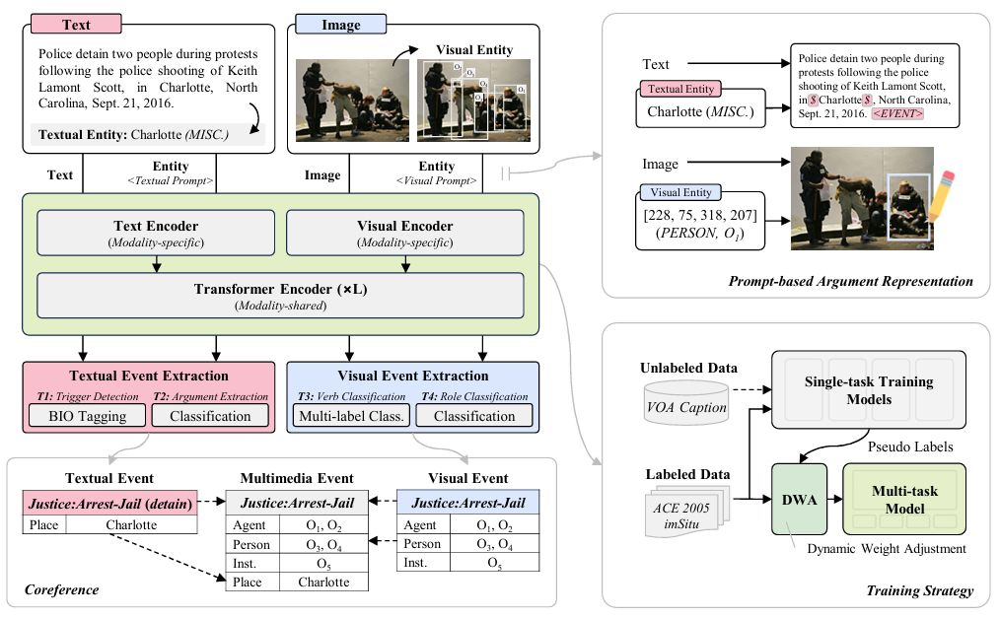

# X-MTL

The code for paper [Cross-modal Multi-task Learning for Multimedia Event Extraction](https://ojs.aaai.org/index.php/AAAI/article/view/33246) [AAAI 2025]



---

### Requirements

To set up the environment, run the following command:

```
pip install -r requirements.txt
```

### Data preparation

Please prepare the `datasets` and `pre-trained models` according to the file structure below. 

> Data can be obtained from [previous work](https://github.com/limanling/m2e2) or directly downloaded from our netdisk [[Quark]](https://pan.quark.cn/s/1d959743dadb).

```
├── data
│   ├── preprocessing
│   └── processed_data
│       ├── ace05-en
│       │   ├── JMEE_train_filter_no_timevalue.json
│       │   ├── JMEE_dev_filter_no_timevalue.json
│       │   └── JMEE_test_filter_no_timevalue.json
│       ├── imSitu
│       │   ├── of500_images_resized
│       │   ├── train.json
│       │   ├── test.json
│       │   ├── dev.json
│       │   └── imsitu_space.json
│       ├── SWiG
│       │   ├── train.json
│       │   ├── test.json
│       │   └── dev.json
│       ├── m2e2_rawdata
│       │   └── image
│       │       └── image
│       ├── m2e2_annotations
│       │   ├── article_event.json
│       │   ├── image_event.json
│       │   ├── crossmedia_coref.txt
│       │   ├── ace_sr_mapping.txt
│       │   ├── m2e2_YOLOv8.json
│       │   ├── text_only_event.json
│       │   ├── image_only_event.json
│       │   ├── text_multimedia_event.json
│       │   └── image_multimedia_event.json
│       └── voa
│           ├── image
│           ├── voa_img_dataset.json
│           ├── voa_text_entity_StanfordNER.json
│           └── voa_image_entity_YOLOv8.json
└── weights
    ├── bert-base-uncased
    ├── clip-vit-base-patch32
    ├── stanford-corenlp-full-2018-10-05
    └── yolov8x.pt
```

### Data Preprocessing

- `ACE 2005`: We follow to process the ACE 2005 dataset. The code can be found in `data/preprocessing/ace05-en` from [ACE2005_preprocessing](https://github.com/zyz0000/ACE2005_preprocessing). Run the command below.
  
  ```
  python main.py --data ACE2005_DATA --nlp STANDFORD_CORE_NLP
  ```

- `M2E2`: For better evaluation, we combine textual event and visual event, generate `article_event.json` and `image_event.json`. The code can be found in `data/preprocessing/m2e2`. Run the command below.
  
  ```
  python combine.py
  ```

- We use [YOLOv8](https://github.com/ultralytics/ultralytics/blob/main/docs/en/models/yolov8.md) and [StanfordNER](https://github.com/stanfordnlp/stanza) to extract entities from image and text. The code can be found in `data/preprocessing/entity`.

- We use [CLIP](https://huggingface.co/openai/clip-vit-base-patch32) to calculate image-text similarity. The relevant code can be found in `src/clip_score.py`.

### Train

- **Step 1**: Train four teacher models for annotating pseudo labels.
  
  ```
  python teacher.py
  ```

- **Step 2**: Generate pseudo labels on the `VOA Caption` dataset.
  
  ```
  python pseudo_label.py
  ```

- **Step 3**: Train the cross-modal multi-task model.
  
  ```
  python xmtl.py
  ```
---

## Citation
If you find our work useful in your research, please consider citing: 
```
@article{Cao_Hu_Tan_Zhao_2025,
  author       = {Cao, Jianwei and Hu, Yanli and Tan, Zhen and Zhao, Xiang},
  title        = {Cross-modal Multi-task Learning for Multimedia Event Extraction},
  journal      = {Proceedings of the AAAI Conference on Artificial Intelligence},
  year         = {2025},
  pages        = {11454--11462}
}
```
